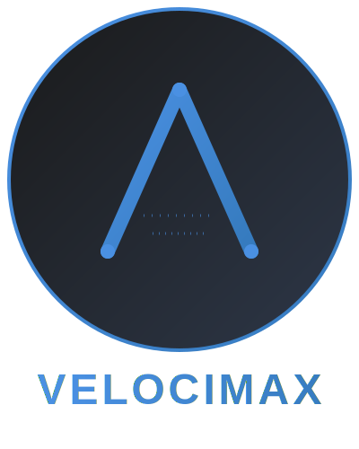
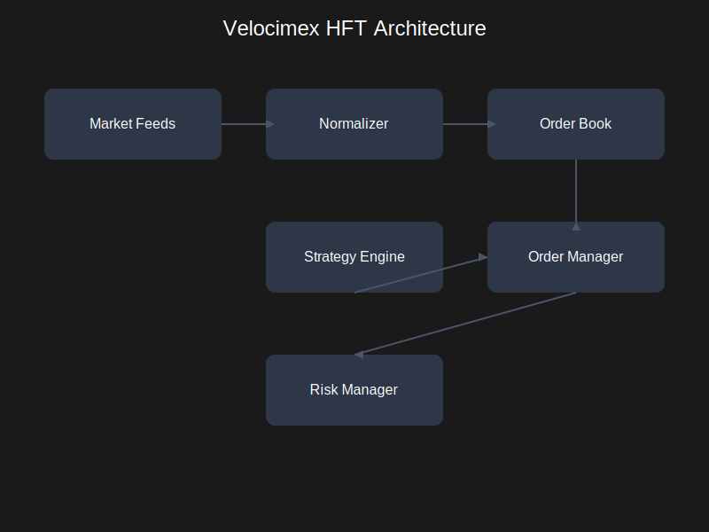

<p align="center">
  
</p>

A high-performance, low-latency High-Frequency Trading (HFT) ecosystem built in Go with a modern React/ShadCN UI.

[](https://go.dev)
[](https://github.com/VrushankPatel/velocimex/actions/workflows/go.yml)
[](LICENSE)
[](https://velocimex.readthedocs.io/)
[](https://www.docker.com/)
[](https://velocimex.readthedocs.io/en/latest/technical/markets/)
[](https://ui.shadcn.com/)
[](https://velocimex.readthedocs.io/en/latest/technical/performance/)

## Overview

Velocimex is a sophisticated high-frequency trading platform designed for professional traders and institutions. It provides real-time market connectivity, advanced order book management, arbitrage detection, and comprehensive visualization tools for trading strategies.



## Key Features

- **Multi-Market Connectivity**
  - Cryptocurrency: Binance, Coinbase, Kraken
  - Stock Markets: NASDAQ, NYSE, NSE, BSE, S&P 500, Dow Jones
  - WebSocket and FIX protocol support

- **Advanced Trading Infrastructure**
  - Real-time order book management
  - Nanosecond-granularity market data processing
  - Cross-exchange arbitrage detection
  - Smart order routing
  - Risk management system

- **Strategy Development**
  - Plugin-based strategy system
  - Advanced backtesting capabilities
  - Realistic latency simulation
  - Paper trading support

- **Enhanced Modern UI/UX**
  - ShadCN-inspired component library
  - Dark/light mode with system preference detection
  - Real-time order book visualization with depth charts
  - Interactive performance monitoring dashboard
  - Advanced strategy analytics and reporting
  - Toast notifications and smart alert system
  - Responsive design for all devices
  - Real-time data streaming with WebSocket
  - Interactive charts with Chart.js integration

- **Enterprise Features**
  - End-to-end encryption
  - Comprehensive logging
  - Prometheus integration
  - Docker containerization
  - High availability support

## Technical Architecture

Velocimex is built with a modular, event-driven architecture optimized for high performance and low latency:

1. **Feed Manager**: Handles connections to various market data sources
2. **Normalizer**: Converts exchange-specific formats to standardized internal format
3. **Order Book Engine**: Maintains real-time order books with full depth
4. **Strategy Engine**: Executes trading strategies and generates signals
5. **Order Manager**: Handles order submission and execution
6. **Risk Manager**: Enforces risk constraints and limits
7. **UI Server**: Provides modern web interface
8. **API Server**: Exposes REST and WebSocket endpoints

## Getting Started

### Prerequisites

- Go 1.19 or higher
- Docker (optional)
- Node.js 16+ (for UI development)

### Installation

1. Clone the repository:
   ```bash
   git clone https://github.com/VrushankPatel/velocimex.git
   cd velocimex
   ```

2. Install dependencies:
   ```bash
   go mod tidy
   ```

3. Configure the system:
   ```bash
   cp config.yaml.example config.yaml
   # Edit config.yaml with your settings
   ```

4. Build and run:
   ```bash
   go build -o velocimex
   ./velocimex
   ```

5. Access the UI at `http://localhost:8080`

## Documentation

Comprehensive documentation is available at [velocimex.readthedocs.io](https://velocimex.readthedocs.io/), including:

- [Installation Guide](https://velocimex.readthedocs.io/en/latest/technical/installation.html)
- [Configuration Guide](https://velocimex.readthedocs.io/en/latest/technical/configuration.html)
- [Quick Start](https://velocimex.readthedocs.io/en/latest/#technical/quick_start.md)
- [Market Connectivity](https://velocimex.readthedocs.io/en/latest/technical/markets.html)
- [Strategy Development](https://velocimex.readthedocs.io/en/latest/technical/first_strategy.html)

## Contributing

We welcome contributions! Please see our [Contributing Guide](CONTRIBUTING.md) for details.

## License

This project is licensed under the MIT License - see the [LICENSE](LICENSE) file for details.

## Disclaimer

This software is for educational and research purposes only. Trading involves significant risk. No part of this software constitutes financial advice. Always do your own research before engaging in trading activities.

## Contact

- **Author**: Vrushank Patel
- **Email**: vrushankpatel5@gmail.com
- **Website**: https://velocimex.readthedocs.io

---

© 2025 Velocimex Technologies | All Rights Reserved

