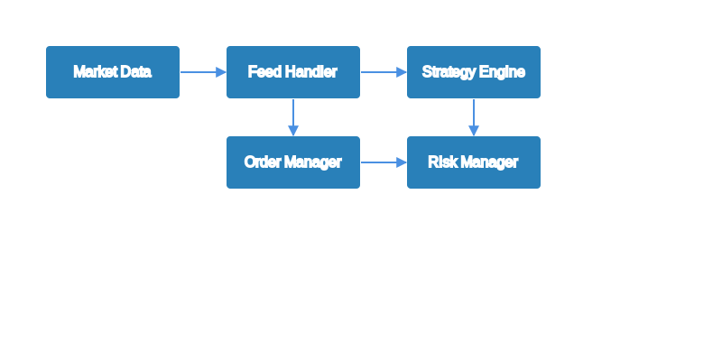

# Technical Documentation

## System Architecture

Velocimex is built using a modular, event-driven architecture designed for high performance and low latency. Below is a detailed overview of the system components and their interactions:

## Core Components

### Market Data Sources
- Direct connections to major exchanges
- Real-time price feeds and order book updates
- Support for multiple data formats and protocols
- Automatic failover and redundancy

### Feed Manager
- Normalizes data from different sources
- Handles connection management
- Implements rate limiting and throttling
- Provides unified data interface

### Order Book Engine
- Maintains full order book depth
- Processes updates with nanosecond precision
- Supports multiple order book representations
- Provides fast lookup and updates

### Strategy Engine
- Plugin-based architecture for custom strategies
- Real-time signal generation
- Backtesting capabilities
- Performance analytics

### Order Manager
- Smart order routing
- Order lifecycle management
- Execution algorithms
- Position tracking

### Risk Manager
- Pre-trade risk checks
- Position limits
- Exposure monitoring
- Circuit breakers

### UI Server
- Modern React-based interface
- Real-time data visualization
- Interactive strategy configuration
- Performance dashboards

### Performance Monitor
- System metrics collection
- Strategy performance tracking
- Latency monitoring
- Resource utilization

## Technology Stack

### Backend
- **Language**: Go 1.19+
- **Framework**: Custom event-driven framework
- **Database**: Time-series optimized storage
- **Message Queue**: High-performance message bus

### Frontend
- **Framework**: React with TypeScript
- **UI Components**: ShadCN UI
- **State Management**: Redux
- **Data Visualization**: D3.js

### Infrastructure
- **Containerization**: Docker
- **Orchestration**: Kubernetes
- **Monitoring**: Prometheus + Grafana
- **Logging**: ELK Stack

## Performance Characteristics

### Latency
- Market data processing: < 1μs
- Strategy execution: < 10μs
- Order submission: < 100μs

### Throughput
- Market data messages: 1M+ per second
- Order processing: 100K+ per second
- Strategy evaluations: 50K+ per second

### Scalability
- Horizontal scaling for market data processing
- Vertical scaling for order book management
- Distributed strategy execution

## Security Measures

### Network Security
- TLS 1.3 for all communications
- API authentication with JWT
- Rate limiting and DDoS protection

### Data Security
- End-to-end encryption for sensitive data
- Secure key management
- Regular security audits

### Access Control
- Role-based access control (RBAC)
- Multi-factor authentication
- Audit logging