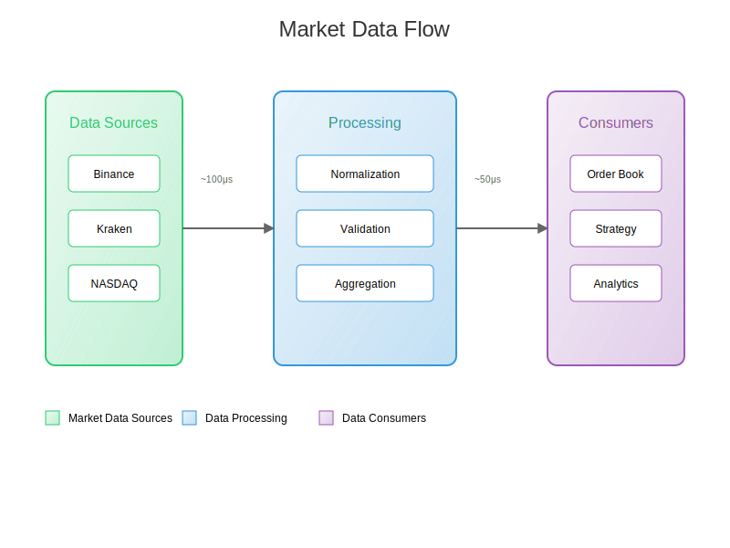

# Market Connectivity

This guide covers the market connectivity features of Velocimex, including supported exchanges, data feeds, and integration details.

## Supported Markets

### Cryptocurrency Exchanges

```{tab} Binance
- **API Version**: v3
- **Websocket Feed**: wss://stream.binance.com:9443
- **Rate Limits**: 1200 requests/minute
- **Order Types**: Market, Limit, Stop, OCO
- **Data Types**: L1, L2, L3, Trades, Tickers
```

```{tab} Kraken
- **API Version**: v2
- **Websocket Feed**: wss://ws.kraken.com
- **Rate Limits**: 60 requests/minute
- **Order Types**: Market, Limit, Stop-Loss
- **Data Types**: L1, L2, Trades, OHLCV
```

```{tab} Coinbase
- **API Version**: v3
- **Websocket Feed**: wss://ws-feed.pro.coinbase.com
- **Rate Limits**: 30 requests/second
- **Order Types**: Market, Limit, Stop
- **Data Types**: L1, L2, Trades
```

### Stock Markets

```{tab} NASDAQ
- **Feed Type**: ITCH 5.0
- **Connection**: TCP/IP
- **Data Types**: TotalView, Level 2
- **Latency**: < 10μs
```

```{tab} NYSE
- **Feed Type**: Pillar Gateway
- **Connection**: FIX 4.2
- **Data Types**: OpenBook, Trades
- **Latency**: < 50μs
```

## Market Data Flow



## Integration Steps

### 1. API Key Setup

#### Binance Setup
```bash
# Generate API keys at https://www.binance.com/en/my/settings/api-management
export BINANCE_API_KEY="your_api_key"
export BINANCE_SECRET="your_secret_key"
```

#### Kraken Setup
```bash
# Generate API keys at https://www.kraken.com/u/security/api
export KRAKEN_API_KEY="your_api_key"
export KRAKEN_SECRET="your_secret_key"
```

### 2. Market Configuration

Edit `config.yaml` to enable specific markets:

```yaml
market_data:
  exchanges:
    - name: binance
      enabled: true
      pairs:
        - BTC-USDT
        - ETH-USDT
      channels:
        - trades
        - book_l2
      options:
        depth: 10
        snapshot_interval: 1000

    - name: kraken
      enabled: true
      pairs:
        - XBT/USD
        - ETH/USD
      channels:
        - trades
        - book
      options:
        depth: 100
```

### 3. Connection Management

```go
// Example connection setup
type MarketConnection struct {
    Exchange    string
    Pairs       []string
    Channels    []string
    WSClient    *websocket.Client
    RestClient  *http.Client
}

func NewMarketConnection(config MarketConfig) (*MarketConnection, error) {
    // Implementation details
}
```

## Data Normalization

### Order Book Format

```json
{
  "exchange": "binance",
  "symbol": "BTC-USDT",
  "timestamp": "2025-01-01T12:00:00.000Z",
  "bids": [
    ["50000.00", "1.5000"],
    ["49999.99", "2.0000"]
  ],
  "asks": [
    ["50000.01", "1.0000"],
    ["50000.02", "3.0000"]
  ]
}
```

### Trade Format

```json
{
  "exchange": "kraken",
  "symbol": "XBT/USD",
  "timestamp": "2025-01-01T12:00:00.000Z",
  "price": "50000.00",
  "amount": "1.5000",
  "side": "buy",
  "id": "123456789"
}
```

## Error Handling

### Common Issues

1. **Rate Limiting**
   ```python
   def handle_rate_limit(response):
       if response.status_code == 429:
           retry_after = int(response.headers['Retry-After'])
           time.sleep(retry_after)
           return retry_request(response.request)
   ```

2. **Connection Drops**
   ```python
   def handle_disconnect(ws):
       backoff = ExponentialBackoff(initial=1, maximum=300)
       while True:
           try:
               ws.connect()
               break
           except ConnectionError:
               time.sleep(backoff.next())
   ```

## Performance Monitoring

### Metrics

1. **Latency Metrics**
   - Connection time
   - Message processing time
   - End-to-end latency

2. **Throughput Metrics**
   - Messages per second
   - Orders per second
   - Data size per second

### Prometheus Metrics

```python
MARKET_DATA_LATENCY = Histogram(
    'market_data_latency_seconds',
    'Market data processing latency',
    ['exchange', 'message_type']
)

MARKET_DATA_MESSAGES = Counter(
    'market_data_messages_total',
    'Total number of market data messages',
    ['exchange', 'message_type']
)
```

## Best Practices

1. **Connection Management**
   - Implement heartbeat monitoring
   - Use exponential backoff for reconnections
   - Maintain connection pools

2. **Data Validation**
   - Validate message checksums
   - Verify sequence numbers
   - Check timestamp freshness

3. **Error Recovery**
   - Implement automatic failover
   - Maintain message queues
   - Log all errors with context

4. **Performance Optimization**
   - Use binary protocols when available
   - Implement message batching
   - Optimize memory allocation

## Next Steps

- [Strategy Development](first_strategy.md)
- [Order Management](order_management.md)
- [Risk Management](risk_management.md) 